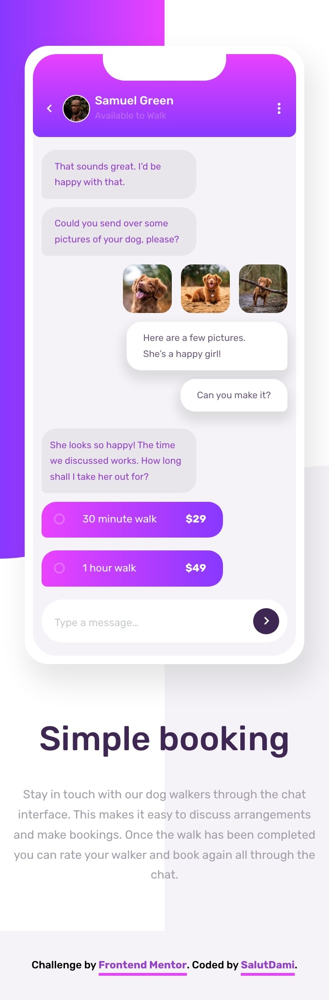
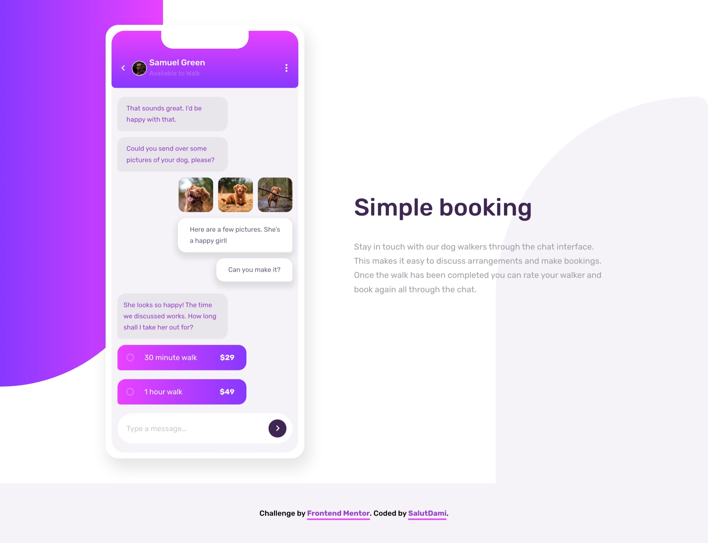

# Frontend Mentor - Chat app CSS illustration solution

This is a solution to the [Chat app CSS illustration challenge on Frontend Mentor](https://www.frontendmentor.io/challenges/chat-app-css-illustration-O5auMkFqY). Frontend Mentor challenges help you improve your coding skills by building realistic projects.

## Table of contents

- [Overview](#overview)
  - [The challenge](#the-challenge)
  - [Screenshot](#screenshot)
  - [Links](#links)
- [My process](#my-process)
  - [Built with](#built-with)
  - [What I learned](#what-i-learned)
  - [Continued development](#continued-development)
  - [Useful resources](#useful-resources)
- [Author](#author)

## Overview

### The challenge

The users would be able to:

- View the optimal layout for the component depending on their device's screen size

### Screenshot



_A screenshot showing the mobile view of the design_



_A screenshot showing the desktop view of the deign_

### Links

- Solution URL: [Add solution URL here](https://github.com/TraversetheDOM/chat-app)
- Live Site URL: [Add live site URL here](https://TraversetheDOM.github.io/chat-app/)

## My process

### Built with

- Semantic HTML5 markup
- CSS custom properties
- Flexbox
- CSS Grid
- Mobile-first workflow

### What I learned

I am really happy that I took on this project as it really tested alot of my skills when using CSS. Nesting the div's was really insteresting in making the design come to life. Using padding's, margin's, pseudo-classes, pseudo-elements, CSS grid and flex box was really fun as it helped me strengthing my understanding of this CSS properties.

Using the psuedo-elements for styling and adding the background to the design. You can see the code snippets below;

```css
.section_chat-app::before {
  content: "";
  display: inline-block;
  position: absolute;
  width: 50%;
  height: 60%;
  background: linear-gradient(
    90deg,
    rgba(136, 56, 255, 1) 0%,
    rgba(233, 66, 255, 1) 100%
  );
  top: 0;
  left: 0;
  z-index: -1;
  border-radius: 0px 0px 1000px 0px;
}

.section_chat-app::after {
  content: "";
  display: inline-block;
  position: absolute;
  width: 50%;
  height: 50%;
  background-color: var(--light-grayish-violet-app-background);
  border-radius: 1000px 0px 0px 0px;
  position: absolute;
  z-index: -1;
  bottom: 0;
  right: 0;
}
```

### Continued development

I woud still keep practicing my CSS. I wasn't able to add some animations for when the page loads so I'll be learning how to do that and implement that in more future projects.

### Useful resources

- [CodeAgam](https://www.youtube.com/watch?v=3snWNzmbpus) - This youtube channel helped me with some of the concepts on how to solve challenge as I took some inspiration from the video.

## Author

## Author

- Twitter - [@\_salutDami](https://www.twitter.com/_salutDami)
- Linkedin- [Ikuomola Stephen](https://www.linkedin.com/in/ikuomola-stephen/)
- Frontend Mentor - [@salutDami](https://www.frontendmentor.io/profile/salutDami)
